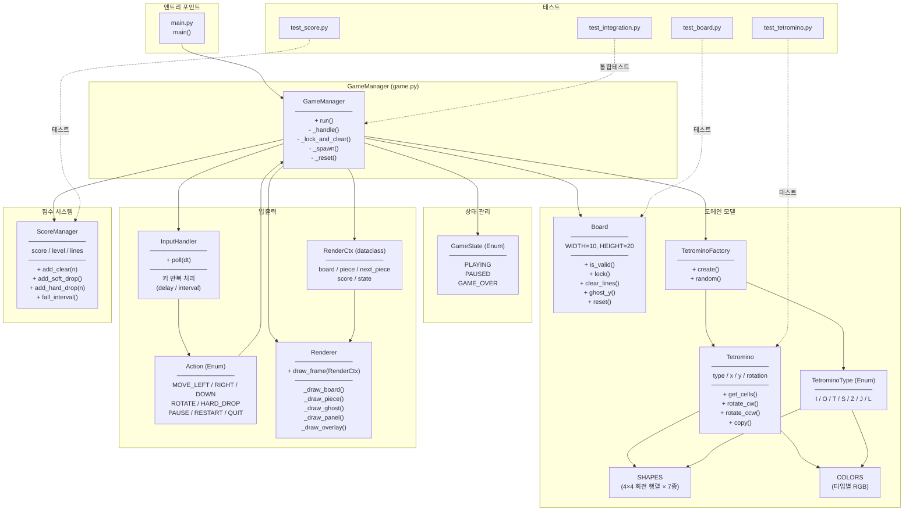
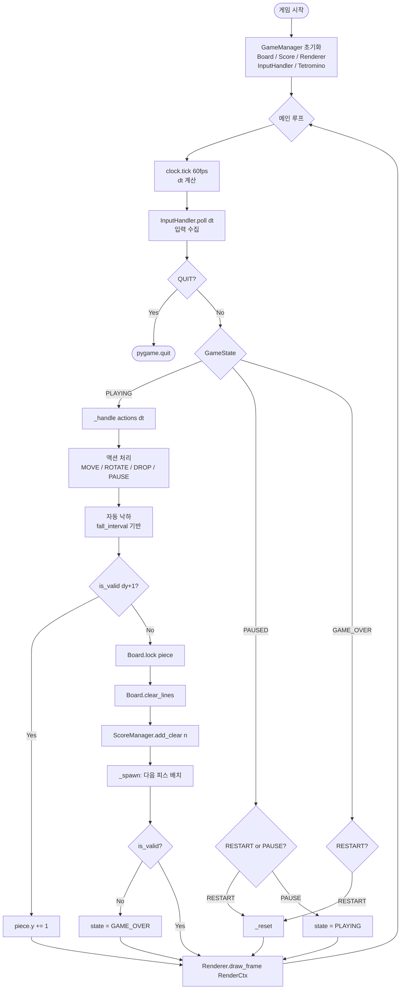
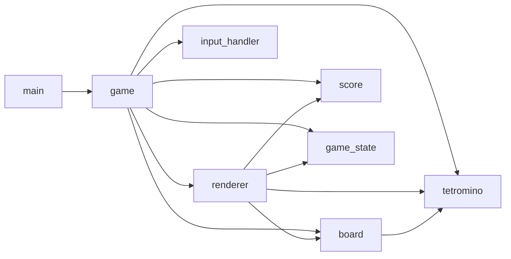
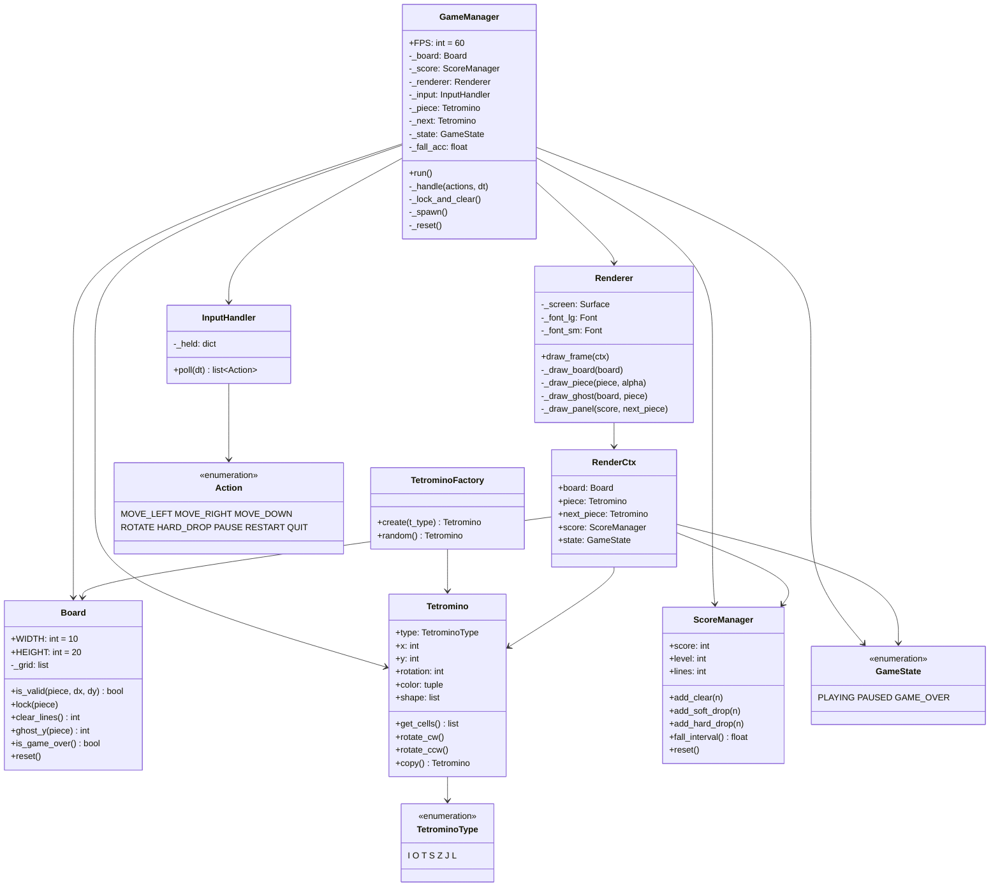

# Tetris Architecture Block Diagram

## 전체 시스템 구성도

```mermaid
graph TB
    subgraph Entry["엔트리 포인트"]
        MAIN["main.py\nmain()"]
    end

    subgraph Core["GameManager (game.py)"]
        GM["GameManager\n─────────────\n+ run()\n- _handle()\n- _lock_and_clear()\n- _spawn()\n- _reset()"]
    end

    subgraph State["상태 관리"]
        GS["GameState (Enum)\n─────────────\nPLAYING\nPAUSED\nGAME_OVER"]
    end

    subgraph Domain["도메인 모델"]
        BOARD["Board\n─────────────\nWIDTH=10, HEIGHT=20\n─────────────\n+ is_valid()\n+ lock()\n+ clear_lines()\n+ ghost_y()\n+ reset()"]

        TETRO["Tetromino\n─────────────\ntype / x / y / rotation\n─────────────\n+ get_cells()\n+ rotate_cw()\n+ rotate_ccw()\n+ copy()"]

        FACTORY["TetrominoFactory\n─────────────\n+ create()\n+ random()"]

        TTYPE["TetrominoType (Enum)\n─────────────\nI / O / T / S / Z / J / L"]

        SHAPES["SHAPES\n(4×4 회전 행렬 × 7종)"]
        COLORS["COLORS\n(타입별 RGB)"]
    end

    subgraph IO["입출력"]
        INPUT["InputHandler\n─────────────\n+ poll(dt)\n─────────────\n키 반복 처리\n(delay / interval)"]

        ACTION["Action (Enum)\n─────────────\nMOVE_LEFT / RIGHT / DOWN\nROTATE / HARD_DROP\nPAUSE / RESTART / QUIT"]

        RENDERER["Renderer\n─────────────\n+ draw_frame(RenderCtx)\n─────────────\n_draw_board()\n_draw_piece()\n_draw_ghost()\n_draw_panel()\n_draw_overlay()"]

        CTX["RenderCtx (dataclass)\n─────────────\nboard / piece / next_piece\nscore / state"]
    end

    subgraph Scoring["점수 시스템"]
        SCORE["ScoreManager\n─────────────\nscore / level / lines\n─────────────\n+ add_clear(n)\n+ add_soft_drop()\n+ add_hard_drop(n)\n+ fall_interval()"]
    end

    subgraph Tests["테스트"]
        T1["test_tetromino.py"]
        T2["test_board.py"]
        T3["test_score.py"]
        T4["test_integration.py"]
    end

    %% 진입점 → 코어
    MAIN --> GM

    %% 코어 의존성
    GM --> BOARD
    GM --> SCORE
    GM --> RENDERER
    GM --> INPUT
    GM --> FACTORY
    GM --> GS

    %% 팩토리 → 테트로미노
    FACTORY --> TETRO
    FACTORY --> TTYPE
    TETRO --> SHAPES
    TETRO --> COLORS
    TTYPE --> SHAPES
    TTYPE --> COLORS

    %% 입력
    INPUT --> ACTION
    ACTION --> GM

    %% 렌더링
    CTX --> RENDERER
    GM --> CTX

    %% 테스트 대상
    T1 -. 테스트 .-> TETRO
    T2 -. 테스트 .-> BOARD
    T3 -. 테스트 .-> SCORE
    T4 -. 통합테스트 .-> GM
```

---

## 게임 루프 흐름도

```mermaid
flowchart TD
    START([게임 시작]) --> INIT[GameManager 초기화\nBoard / Score / Renderer\nInputHandler / Tetromino]
    INIT --> LOOP{메인 루프}

    LOOP --> TICK[clock.tick 60fps\ndt 계산]
    TICK --> POLL[InputHandler.poll dt\n입력 수집]

    POLL --> QUIT{QUIT?}
    QUIT -- Yes --> END([pygame.quit])
    QUIT -- No --> STATE{GameState}

    STATE -- PLAYING --> HANDLE[_handle actions dt]
    STATE -- PAUSED --> PAUSE_CHECK{RESTART or PAUSE?}
    STATE -- GAME_OVER --> GO_CHECK{RESTART?}

    PAUSE_CHECK -- RESTART --> RESET[_reset]
    PAUSE_CHECK -- PAUSE --> RESUME[state = PLAYING]
    GO_CHECK -- RESTART --> RESET

    HANDLE --> ACTION_PROC[액션 처리\nMOVE / ROTATE / DROP / PAUSE]
    ACTION_PROC --> FALL[자동 낙하\nfall_interval 기반]
    FALL --> VALID{is_valid dy+1?}

    VALID -- Yes --> DROP_PIECE[piece.y += 1]
    VALID -- No --> LOCK[Board.lock piece]

    LOCK --> CLEAR[Board.clear_lines]
    CLEAR --> ADD_SCORE[ScoreManager.add_clear n]
    ADD_SCORE --> SPAWN[_spawn: 다음 피스 배치]
    SPAWN --> GAME_OVER_CHECK{is_valid?}

    GAME_OVER_CHECK -- No --> GAMEOVER[state = GAME_OVER]
    GAME_OVER_CHECK -- Yes --> DRAW

    DROP_PIECE --> DRAW
    RESUME --> DRAW
    RESET --> DRAW
    GAMEOVER --> DRAW

    DRAW[Renderer.draw_frame RenderCtx] --> LOOP
```

---

## 모듈 의존 관계

```mermaid
graph LR
    main --> game
    game --> board
    game --> tetromino
    game --> score
    game --> renderer
    game --> input_handler
    game --> game_state
    renderer --> board
    renderer --> tetromino
    renderer --> score
    renderer --> game_state
    board --> tetromino
```

---

## 클래스 관계도

```mermaid
classDiagram
    class GameManager {
        +FPS: int = 60
        -_board: Board
        -_score: ScoreManager
        -_renderer: Renderer
        -_input: InputHandler
        -_piece: Tetromino
        -_next: Tetromino
        -_state: GameState
        -_fall_acc: float
        +run()
        -_handle(actions, dt)
        -_lock_and_clear()
        -_spawn()
        -_reset()
    }

    class Board {
        +WIDTH: int = 10
        +HEIGHT: int = 20
        -_grid: list
        +is_valid(piece, dx, dy) bool
        +lock(piece)
        +clear_lines() int
        +ghost_y(piece) int
        +is_game_over() bool
        +reset()
    }

    class Tetromino {
        +type: TetrominoType
        +x: int
        +y: int
        +rotation: int
        +color: tuple
        +shape: list
        +get_cells() list
        +rotate_cw()
        +rotate_ccw()
        +copy() Tetromino
    }

    class TetrominoFactory {
        +create(t_type) Tetromino
        +random() Tetromino
    }

    class TetrominoType {
        <<enumeration>>
        I O T S Z J L
    }

    class ScoreManager {
        +score: int
        +level: int
        +lines: int
        +add_clear(n)
        +add_soft_drop(n)
        +add_hard_drop(n)
        +fall_interval() float
        +reset()
    }

    class Renderer {
        -_screen: Surface
        -_font_lg: Font
        -_font_sm: Font
        +draw_frame(ctx)
        -_draw_board(board)
        -_draw_piece(piece, alpha)
        -_draw_ghost(board, piece)
        -_draw_panel(score, next_piece)
    }

    class RenderCtx {
        +board: Board
        +piece: Tetromino
        +next_piece: Tetromino
        +score: ScoreManager
        +state: GameState
    }

    class InputHandler {
        -_held: dict
        +poll(dt) list~Action~
    }

    class Action {
        <<enumeration>>
        MOVE_LEFT MOVE_RIGHT MOVE_DOWN
        ROTATE HARD_DROP PAUSE RESTART QUIT
    }

    class GameState {
        <<enumeration>>
        PLAYING PAUSED GAME_OVER
    }

    GameManager --> Board
    GameManager --> ScoreManager
    GameManager --> Renderer
    GameManager --> InputHandler
    GameManager --> Tetromino
    GameManager --> GameState
    TetrominoFactory --> Tetromino
    Tetromino --> TetrominoType
    InputHandler --> Action
    Renderer --> RenderCtx
    RenderCtx --> Board
    RenderCtx --> Tetromino
    RenderCtx --> ScoreManager
    RenderCtx --> GameState
```
